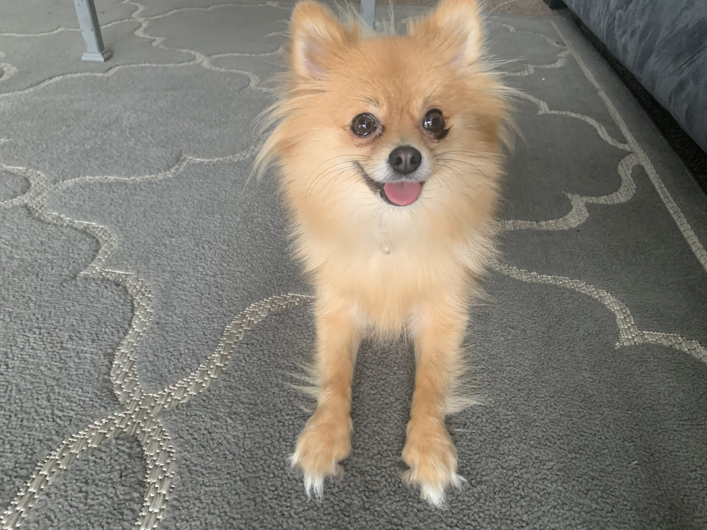

# Dog Grooming Is Expensive : Learn To Do It Yourself!
## Why Do It Yourself?
- Caring for a dog is a lot of work as it is; you already need to pay for food, vet vistis, a crate or bed, things to keep them entertained, AND for regular grooming.
- Full Servie Grooming - which includes bath, hair trim, nail trim, ear and teeth cleaning - differs by dog size and breed. My 5lbs dog costs $70 for a full service, and I used to do those every other month since her hair grows and she starts to smell strongly of dog pretty fast.
- A regular nail trim costs $16 at [PetSmart](https://services.petsmart.com), and a nail trim and grind (so that the nails stay short longer) costs $20. Doing that every month will eventually pile up to be a lot of money spent.
- Learning to groom your dog (or pet in general) could save you lots of money in the long run!

## What Should You Do To Get Started? 
- First, buy a grooming kit! [Amazon](https://www.amazon.com/s?k=dog+grooming+kit&crid=3KLT9IAJNN84B&sprefix=dog+grooming+kit%2Caps%2C158&ref=nb_sb_noss_1) offers a variety of kits that cost around $20 on average. It comes with grooming scissors, shaver clippers, nail clippers, a comb, and more!
- You can also buy ear cleaners, dog toothbrushes, and shampoos in stores like Walmart as well.
- Next, watch a few videos on how to groom your dog breed. I personally watched [this one](https://www.youtube.com/watch?v=aPTZKqkeRq4) to help me get started.

## How You Should Improve?
- The only real way to improve is to keep practicing. Even if you are scared of messing up your dog's beatiful hair, just remember that <mark>hair grows back</mark> and they probably <mark>don't mind how they look</mark> anyways!
### Here's A Before And After Of My Dog 😊

